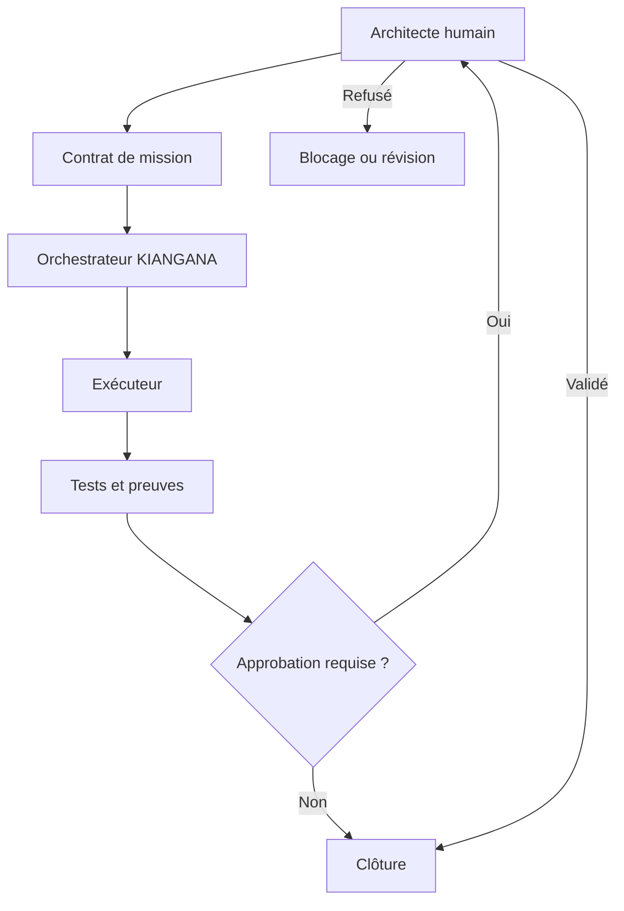

# Architecture opérationnelle

## États d’une mission

`proposed → approved → running → verification → closed`

Sorties alternatives : `blocked` ou `cancelled`.

## Frontières

- Le plan de contrôle décide ce qui peut être fait.
- Les plugins n’accordent aucune autorité par eux-mêmes.
- Les exécutants reçoivent uniquement les données et permissions nécessaires.
- Le vérificateur compare le résultat aux critères, pas à l’intention supposée.
- Le rapport de clôture relie chaque affirmation à une preuve.

